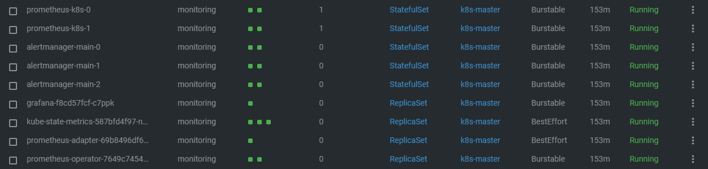
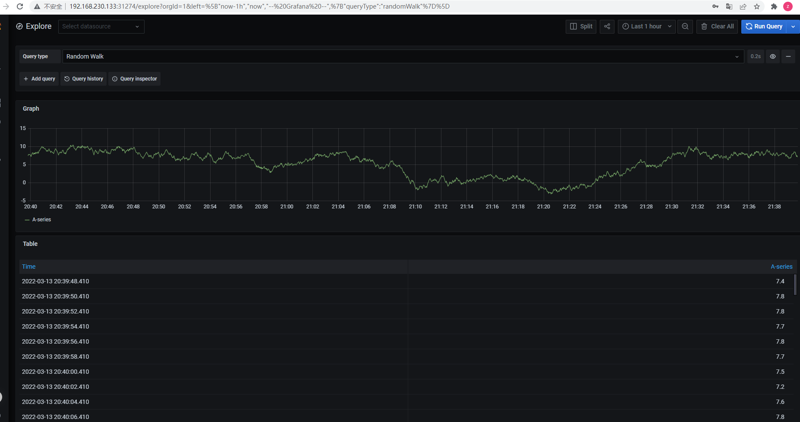
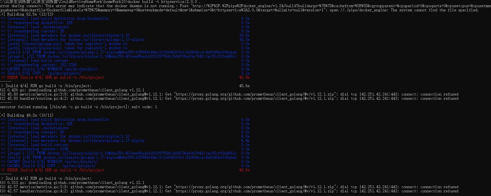

####   为HTTPServer添加0-2秒的随机延时
```  
        time.Sleep(time.Millisecond * time.Duration(rand.Intn(2000)))
		cost := time.Since(start)
		metrics.RequestsCost.WithLabelValues(request.Method, request.RequestURI).Observe(cost.Seconds())
```
####   为HTTPServer项目添加延时Metric
``` metric
metrics/metrics.go
```

####   将HTTPServer部署至测试集群，并完成Prometheus配置
```


git clone https://github.com/prometheus-operator/kube-prometheus.git

修改 
```
grafana-service.yaml
prometheus-service.yaml
type=nodeport

```


kubectl apply -f manifests
kubectl apply -f setup
``` 
####   从Promethus界面中查询延时指标数据


####  （可选）创建一个Grafana Dashboard展现延时分配情况


### TODO httpservice:2.0.0 
#### 因为网络问题build提交dockerhub失败 

