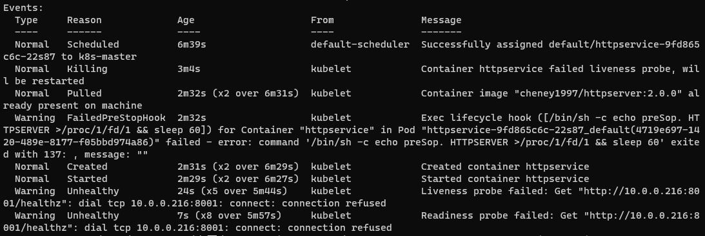

###安装istio

```azure
wget https://github.com/istio/istio/releases/download/1.13.2/istio-1.13.2-linux-amd64.tar.gz
tar xzf istio-1.13.2-linux-amd64.tar.gz -C /usr/local/

echo 'export ISTIO_HOME=/usr/local/istio-1.13.2' >> /etc/profile
echo 'export PATH=$PATH:$ISTIO_HOME/bin' >> /etc/profile

source /etc/profile

cp bin/istioctl /usr/local/bin
    
istioctl install --set profile=demo -y


```

###检查istio
```
k get pod  -n istio-system 

创建命名空间
k create ns hskchen 

建立标签给istio  istio-injection=enabled
k label ns hskchen istio-injection=enabled 

```

###创建service
```azure
 k create -f httpservice-deploy.yaml -n hskchen
 
 生成证书签发密钥
 
 openssl req -x509 -sha256 -nodes -days 365 -newke
y rsa:2048 -subj "/CN=*.hskchen.com/O=hskchen" -keyout hskchen.key -out hskchen.crt

k create -n istio-system secret tls hskchen-credential --key hskchen.key --cert=hskchen.crt


```

###创建istio 
```azure
k apply -f istio-specs.yaml -n hskchen

检查ingress svc
k get svc -n istio-system
```
###安装trace
```azure
k apply -f jaeger.yaml

k edit configmap istio -n istio-system

set tracing.sampling=100
```
###配置traceing
```azure
k create ns tracing
k label ns tracing istio-injection=enabled
k -n tracing apply -f service0.yaml
k -n tracing apply -f service1.yaml
k -n tracing apply -f service2.yaml
k apply -f istio-specs.yaml -n tracing
```
describe error


